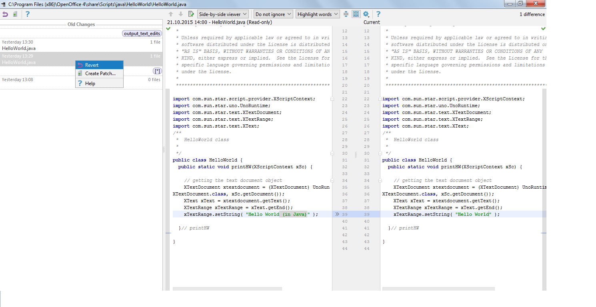
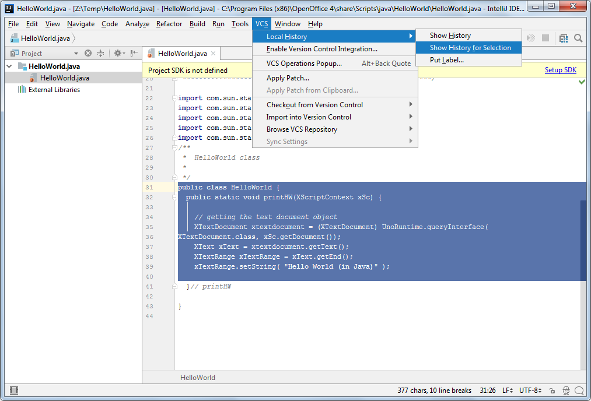
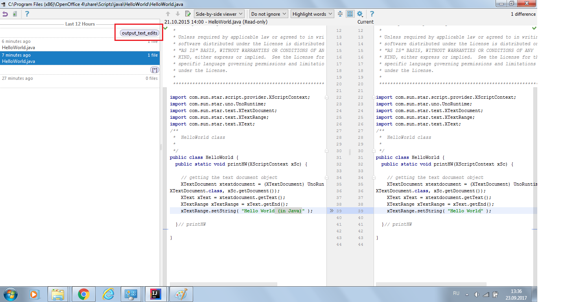
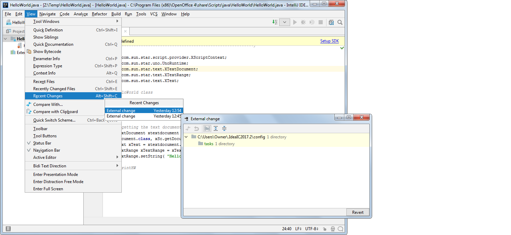

# test
<h1>Using Local History for Change Tracking</h1>
In this section:
<a href="#local-history-feature">Local History Overview</a>
<a href="#tracking-and-reverting-changes-with-local- history">Tracking and Reverting Changes with Local History</a>

<h2>Local History Feature</h2>

<h3>Basics</h3>
Local History is a built-in feature of IntelliJ IDEA that automatically tracks changes you make to the source code on your local computer. Similarly to any version control system (VCS), it enables you to compare versions and roll changes back, if necessary. Local History, however, does not support shared access – it operates independently from the global VCS. The good news is that it works out of the box: even if your project is not under any VCS control, or when you are not connected to the network, you can manage changes to your project files.

Local History window looks like shown below:

Local History dialog elements and controls are described in detail in the <a href="https://www.jetbrains.com/help/idea/show-history-for-folder-dialog.html">Show History for Folder Dialog</a> and <a href="https://www.jetbrains.com/help/idea/show-history-for-file-selection-dialog.html">Show History for File/Selection Dialog</a> sections.

The steps needed to invoke this dialog for selected entity are described in the <a href="#tracking-and-reverting-changes-with-local- history">Tracking and Reverting Changes with Local History</a> section.

<h3>How It Works</h3>
Local History feature tracks changes you make to the source code, results of refactoring, and state of the source code based on a set of predefined events (testing, deployment, commit or update). 
It applies to any structural artifacts: projects, directories, packages, files, classes, class members, tags and selected fragments of text. 

Local History revisions are marked with <i>labels</i>, which are similar to versions in traditional version control systems. Viewing or reverting or differences is performed against these labels.

Labels based on predefined events are added to the local revisions automatically. Besides, you can manually put your own labels to the project artifacts to mark your changes. See <a href="#using-custom-labels">Using Custom Labels</a> for details.

Local history is cleared when you install a new version of IntelliJ IDEA or when you invalidate caches. So, before performing these operations make sure you checked in the necessary changes into your global version control system.

<h3>Considerations and Limitations</h3>
<ol>
 <li>Tracking local changes is only possible for text files. Local History for binary files is not supported.</li>
 <li>Limited functionality for large files: for files larger than 1 MB, Local History tracks only the very fact of changes, but does not preserve the exact content modifications.</li>
<li>Remember that Local History does not support shared access – it is intended for personal use only.</li>
</ol>

<h2>Tracking and Reverting Changes with Local History</h2>
This section describes how to:
<ul>
<li><a href="#viewing-local-history-of-a-file-or-folder">View local history of a file or folder</a></li>
<li><a href="#reverting-changes-for-a-file-or-folder">Revert changes for a file or folder</a></li>
<li><a href="#viewing-local-history-of-source-code">View local history of source sode</a></li>
<li><a href="#using-custom-labels">Use custom labels</a></li>
<li><a href="#viewing-summary-of-changes-for-projects">View summary of changes for projects</a></li>
</ul>

<h3>Viewing Local History of a File or Folder</h3>
You can view local history, compare versions and revert changes made to the files and folders. 

To track changes to a file or folder:
<ol>
<li>Select the necessary file or folder in the <b>Project</b> tool window. A file can be also opened in the editor.

 
</li>
<li>Open the <b>Local History</b> window for selection in any of the following ways:
 <ul>
 <li>In the main menu, select  <b>VCS | Local History | Show History</b>, or use the same command from the shortcut menu of the selection.</li>
 <li>If you prefer using hotkeys, press <i>Alt+Back Quote</i>, then from the <b>VCS Operations</b> quick list select the <b>Show History</b> command.
 

 
 </li>
 <li>You can also use the  <b>Recent Changes</b> view that shows a summary of recent changes to the project in a single pop-up list. Click a list entry to open Local History for it.</li>
 </ul>
 <li>In the left pane of the Local History dialog window, select the revision you need. Then in the right pane you can compare local versions of the selected file or folder, and accept or revert changes. See the <a href="https://www.jetbrains.com/help/idea/show-history-for-folder-dialog.html">Show History for File Dialog</a> and <a href="https://www.jetbrains.com/help/idea/show-history-for-file-selection-dialog.html">Show History for File/Selection Dialog</a> sections for detailed list of options available in this dialog.
 

Note that:
 <ul>
  <li>Local History for a file includes all changes that affect both the selected file and the whole project.</li>
  <li>Local History for a folder shows changes to the source code tree in general.</li>
 </ul>
 </ol>
<h3>Reverting Changes for a File or Folder</h3>
You can roll back file or folder changes using local history in same way as the regular version control.
To revert changes made to a file or folder:
<ol>
<li>Open the Local History view for the file or folder you need, as described in the section above.</li>
<li>Select the version you want to roll back to and examine the changes.</li>
<li>Click the <b>Revert</b> button on the toolbar, or use the shortcut menu command.</li>
</ol>

<h3>Viewing Local History of Source Code</h3>
You can also use Local History to examine local changes of a class, its elements (methods and fields), or selected block of source code. 
To view local history of a class:
<ol>
<li>In the <b>Project</b> tool window, select a class file, or right-click the class name in the editor.</li>
<li>In the main menu, select <b>VCS | Local History | Show History for Class</b>. Alternatively, you can invoke this command from the shortcut menu of the selection.</li>
</ol>

To view local history of a method or a field:
<ol>
<li>In the editor, place the cursor at the name of the desired method or field.</li>
<li>In the main menu, select <b>VCS | Local History | Show History for Method (Field)</b>. Alternatively, you can invoke this command from the shortcut menu of the selection.</li>
</ol>
Note that method/field local history shows only the changes that affect the selected element.

To view local history of a source code block:
<ol>
<li>In the editor, select a fragment of the source code.</li>
<li>In the main menu, select <b>VCS | Local History | Show History for Selection</b>. Alternatively, you can invoke this same command from the shortcut menu of the selection.</li>
</ol>

<b>Tip:</b> If you prefer using hotkeys, press <i>Alt+Back Quote</i> to display <b>VCS Operations</b> quick list, then select <b>Show History</b>.

When the Local History dialog opens, in the left pane select the revision you need. Then in the right pane you can compare local versions of selected file or folder, and accept or revert changes. See the <a href="https://www.jetbrains.com/help/idea/show-history-for-file-selection-dialog.html"> Show History for File/Selection Dialog</a> section for detailed list of options available in this dialog.

<h3>Using Custom Labels</h3>
Best practices recommend that before any uncertain change to your source code, you mark the stable version with a meaningful label. This will help you quickly roll back to a safe version.
Labels apply to a whole project; manually put labels cannot be edited after they are assigned.
To add a label to a local version:
<ol>
<li>In the <b>Project</b> tool window, select a project file or folder, or open a file in the editor.</li>
<li>From the main menu, select <b>VCS | Local History | Put Label</b>. Alternatively, you can invoke this same command from the shortcut menu of the selection. If you prefer using hotkeys, press <i>Alt+Back Quote</i> to display <b>VCS Operations</b> quick list, then select <b>Put Label</b>.</li>
<li>In the Put Label dialog box, type the label name. It is recommended to enter some meaningful unique name to distinguish the current version. You can use standard characters or wildcards.</li>
<li>Click <b>OK</b> to assign the label and close the dialog.</li>
</ol>

When you open the Local History window for this file/folder, historical versions will be shown in the left pane with the label you put.

<h3>Viewing Summary of Changes for Projects</h3>
IntelliJ IDEA allows you to view the summary of recent changes to all recent projects, the IntelliJ IDEA configuration directory, and so on. 
To view the summary of local changes to a directory or project:
<ol>
<li>In the main menu, select <b>View | Recent Changes</b>, or press <i>Shift+Alt+C</i>.
<li>In the <b>Recent Changes</b> list, select the change you need.</li>
<li>In the dialog that opens you can view what directory and/or project was affected and, if necessary, revert the changes. Note that changes for your selection will be reverted in bulk. </li>
</ol>

