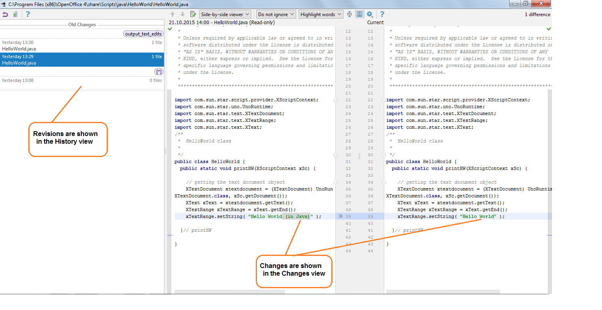
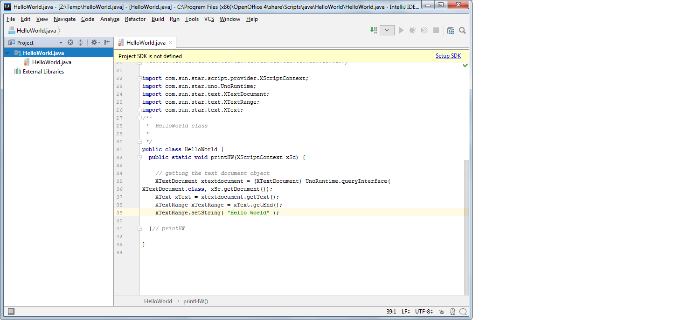
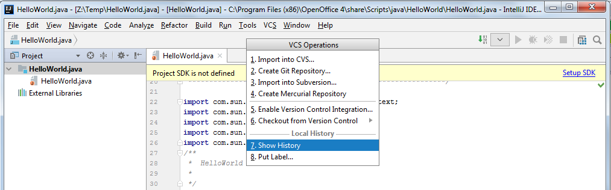
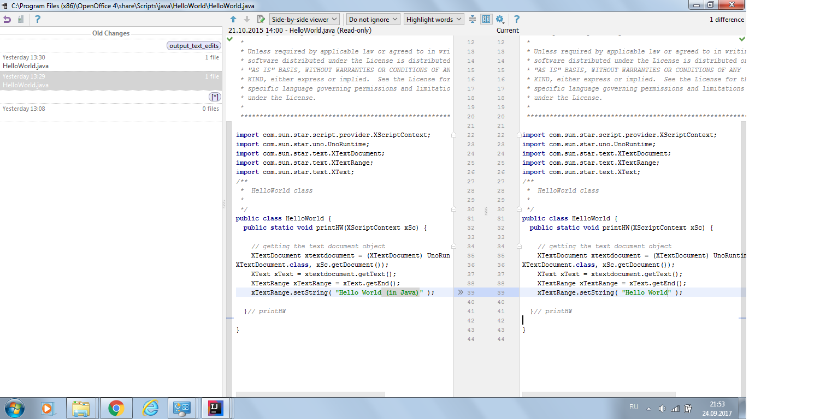

# test
<h1>Using Local History for Change Tracking</h1>
<h2>Local History Feature</h2>

<h3>Basics</h3>
Local History is a built-in feature of IntelliJ IDEA that automatically tracks changes you make to the source code on your local computer. Similarly to any version control system (VCS), it enables you to compare versions and roll changes back, if necessary. Local History, however, does not support shared access – it operates independently from the global VCS. The good news is that it works out of the box: even if your project is not under any VCS control, or when you are not connected to the network, you can manage changes to your project files.

Local History window looks like shown below:
 

 
Its elements are described in detail in the <a href="https://www.jetbrains.com/help/idea/show-history-for-folder-dialog.html">Show History for File Dialog</a> and <a href="https://www.jetbrains.com/help/idea/show-history-for-file-selection-dialog.html">Show History for File/Selection Dialog</a> sections.

The steps needed to invoke this dialog for selected entity are described in the “Tracking and Reverting Changes with Local History” section.

<h3>How It Works</h3>
Local History feature tracks changes you make to the source code, results of refactoring, and state of the source code based on a set of predefined events (testing, deployment, commit or update). 
It applies to any structural artifacts: projects, directories, packages, files, classes, class members, tags and selected fragments of text. 

Local History revisions are marked with <i>labels</i>, which are similar to versions in traditional version control systems. Viewing or reverting or differences is performed against these labels.

Labels based on predefined events are added to the local revisions automatically. Besides, you can manually put your own labels to the project artifacts to mark your changes. See “Using Custom Lables” for details.
Local history is cleared when you install a new version of IntelliJ IDEA or when you invalidate caches. So, before performing these operations make sure you checked in the necessary changes into your global version control system.

<h3>Considerations and Limitations</h3>
<ol>
 <li>Tracking local changes is only possible for text files. Local History for binary files is not supported.</li>
 <li>Limited functionality for large files: for files larger than 1 MB, Local History tracks only the very fact of changes, but does not preserve the exact content modifications.</li>
<li>Remember that Local History does not support shared access – it is intended for personal use only.</li>
</ol>

<h2>Tracking and Reverting Changes with Local History</h2>
This section describes how to:
<ul>
<li>View local history of a file or folder</li>
<li>View local history of a class, method, field or selection</li>
<li>View local history of a selection</li>
<li>View recent changes</li>
<li>Restore files from local history</li>
<li>Mark local versions with labels</li>
 </ul>

<h3>Viewing Local History of a File or Folder</h3>
You can view local history, compare versions and revert changes made to the files and folders. 

To track changes to a file or folder:
<ol>
<li>Select the necessary file or folder in the <b>Project</b> tool window. A file can be also opened in the editor.

 
</li>
<li>Open the <b>Local History</b> window for selection in any of the following ways:
 <ul>
 <li>In the main menu, select  <b>VCS | Local History | Show History</b>, or use the same command from the shortcut menu of the selection.</li>
 <li>If you prefer using hotkeys, press <i>Alt+Back Quote</i>, then from the <b>VCS Operations</b> quick list select the <b>Show History</b> command.
 
 
 </li>
 <li>You can also use the  <b>Recent Changes</b> view that shows a summary of recent changes to the project in a single pop-up list. Click a list entry to open Local History for it.</li>
 </ul>
 <li>In the Local History dialog window, select in the left pane select the revision you need. Then in the right pane you can compare local versions of selected file or folder, and accept or revert changes. See the <a href="https://www.jetbrains.com/help/idea/show-history-for-folder-dialog.html">Show History for File Dialog</a> and <a href="https://www.jetbrains.com/help/idea/show-history-for-file-selection-dialog.html">Show History for File/Selection Dialog</a> sections for detailed list of options available in this dialog.

Note that:
 <ul>
  <li>Local History for a file includes all changes that affect both the selected file and the whole project</li>
  <li>Local History for a folder shows changes to the source code tree in general</li>
 </ul>
 </ol>

